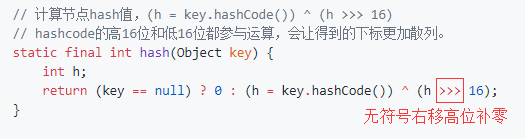
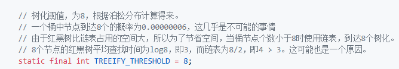
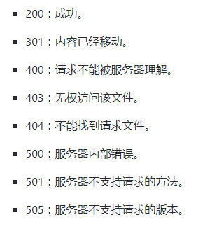

# 二叉树的非递归遍历

```java
public class TreeNode{
	int val;
	TreeNode left;
	TreeNode right;
	TreeNode(int x){
		val=x;
	}
}
```

```java
//先序
public void xianXv(TreeNode treeNode){
    Stack<TreeNode>stack=new Stack<TreeNode>();
    while(treeNode!=null||!stack.isEmpty()){
        while(treeNode!=null){
            xianxvList.add(treeNode.val);
            stack.push(treeNode);
            treeNode=treeNode.left;
        }
        if(!stack.isEmpty()){
            treeNode=stack.pop();
            treeNode=treeNode.right;
        }
    }
}
```

```java
//中序
public void zhongXv(TreeNode treeNode){
    Stack<TreeNode> stack=new Stack<TreeNode>();
    while(treeNode!=null||!stack.isEmpty()){
        while(treeNode!=null){
            stack.add(treeNode.val);
            treeNode=treeNode.left;
        }
        if(!stack.isEmpty()){
            treeNode=stack.pop();
            zhongxvList.add(treeNode.val);
            treeNode=treeNode.right;
        }
    }
}
```

```java
//后续
public void houXv(TreeNode treeNode){
    Stack<TreeNode> stack=new Stack<TreeNode>();
    while(treeNode!=null||!stack.isEmpty()){
        while(treeNode!=null){
            stack.push(treeNode);
            treeNode=treeNode.left;
        }
        boolean tag=true;
        //前驱结点
        TreeNode preNode=null;
        while(!stack.isEmpty()&&tag==true){
            treeNode=stack.peek();
            //之前访问的结点是空节点或者是栈顶元素的右结点
            if(treeNode.right==preNode){
                treeNode=stack.pop();
                houxvList.add(treeNode.val);
                if(stack.isEmpty()){
                    return;
                }
                else{
                    preNode=treeNode;
                }
            }
            else{
                treeNode=treeNode.right;
                tag=false;
            }
        }
    }
}
```

```java
//层序
public void cengXv(TreeNode treeNode){
    if(treeNode==null){
        return;
    }
    LinkendList<TreeNode> queue=new LinkedList<TreeNode>();
    TreeNode current=null;
    queue.offer(treeNode);
    while(!queue.isEmpty()){
        current=queue.poll();
        cenxvList.add(current.val);
        if(current.left!=null){
            queue.offer(current.left);
        }
        if(current.right!=null){
            queue.offer(current.right);
        }
    }
}
```

如果非要让用堆栈实现除层序遍历，可以用两个堆栈构建成队列。这时一共有二种情况：

```java
//堆栈二为空这时堆栈一可入堆栈二，并且必须全入
//堆栈二不为空，堆栈一不可入堆栈二
```


# 求完全二叉树的结点数量非O(n)时间复杂度

```java
class Node{
    public int value;
    public Node left;
    public Node right;
    
    public Node(int data){
        this.value=data;
    }
}
//在求结点数是调用此函数就好
public int nodeNum(Node head){
    if(head==null){
        return 0;
    }
    return bs(head,1，mostLeftLevel(head,1));
}

public int bs(Node node, int l, int h){
    if(l==h){
        return 1;
    }
    //如果右子树最左子树高度和左子树一样，那么左子树为满二叉树
    if(mostLeftLevel(node.right,l+1)==h){
        return (1<<(h-1))+bs(node.right,l+1,h);
    }
    //否则右子树为比左子树高度低1的满二叉树
    else{
        return (1<<(h-l-1))+bs(node.left,l+1,h);
    }
}

public int mostLeftLevel(Node node, int level){
    while(node!=null){
        level++;
        node=node.left;
    }
    return level-1;
}
```


# 九大排序

```java
//冒泡排序
public int[] bubbleSort(int[] array){
    if(array.length==0)
        return array;
    for(int i=0;i<array.length;i++){
        for(int j=0;j<array.length-1-i;j++){
            if(array[j+1]<array[j]){
                int temp=array[j+1];
                array[j+1]=array[j];
                array[j]=temp;
            }
        }
    }
    return array;
}
```

```java
//选择排序
public init[] sellectionSort(int[] array){
    if(array.length==0)
        return array;
    for(int i=0;i<array.length;i++){
        int minIndex=i;
        for(int j=i;j<array.length;i++){
            if(array[j]<array[minIndex]){
                minIndex=j;
            }
        }
        int temp=array[minIndex];
        array[minIndex]=array[i];
        array[i]=temp;
    }
    return array;
}
```

```java
//插入排序
public init[] insertionSort(int[] array){
    if(array.length==0)
        return array;
    int current;
    for(int i=0;i<array.length-1;i++){
        current=array[i+1];
        int preIndex=i;
        while(preIndex>=0&&current<array[prIndex]){
            array[preIndex+1]=array[preIndex];
            preIndex--;
        }
        array[preIndex+1]=current;
    }
    return array;
}
```

```java
// 堆排序
public void heapSort(int[] arr){
    if(arr=null||arr.length<2)
        return;
    //循环整个数组，进入一个插入一个，构造出一棵初始大顶堆
    for(int i=0;i<arr.length;i++){
        heapInsert(arr,i);
    }
    int size=arr.length;
    //从这里，取堆顶，修改堆，直到排序结束
    swap(arr,0,--size);
    while(size>0){
        heapify(arr,0,size);
        swap(arr,0,--size);
    }
}
//构建初始堆
public void heapInsert(int[] arr, int index){
    while(arr[index]>arr[(index-1)/2]){
        swap(arr,index,(index-1)/2);
        index=(index-1)/2;
    }
}
//取堆顶排序，取堆顶排序……
public void heapify(int[] arr, int index, int size){
    int left=index*2+1;
    while(left<size){
        int lareest=left+1<size&&arr[left+1]>arr[left]?left+1:left;
        largest=arr[largest]>arr[index]?largest:index;
        if(largest==index){
            break;
        }
        swap(arr,largest,index);
        index=largest;
        left=index*2+1;
    }
}
public void swap(int[] arr, int i, int j){
    int tmp=arr[i];
    arr[i]=arr[j];
    arr[j]=tmp;
}
```


# HashMap源码

[https://github.com/hanggegreat/CS-Tree/blob/master/Java/%E9%9B%86%E5%90%88%E6%BA%90%E7%A0%81/HashMap.md](https://github.com/hanggegreat/CS-Tree/blob/master/Java/集合源码/HashMap.md)



为什么HashMap当桶中链表值大于等于8时，进行红黑树化




# Http



```
HTTP作为无状态协议，必然需要在某种方式保持连接状态。这里简要介绍一下Cookie和Session。

- Cookie

    Cookie是客户端保持状态的方法。

    Cookie简单的理解就是存储由服务器发至客户端并由客户端保存的一段字符串。为了保持会话，服务器可以在响应客户端请求时将Cookie字符串放在Set-Cookie下，客户机收到Cookie之后保存这段字符串，之后再请求时候带上Cookie就可以被识别。

    除了上面提到的这些，Cookie在客户端的保存形式可以有两种，一种是会话Cookie一种是持久Cookie，会话Cookie就是将服务器返回的Cookie字符串保持在内存中，关闭浏览器之后自动销毁，持久Cookie则是存储在客户端磁盘上，其有效时间在服务器响应头中被指定，在有效期内，客户端再次请求服务器时都可以直接从本地取出。需要说明的是，存储在磁盘中的Cookie是可以被多个浏览器代理所共享的。

- Session

    Session是服务器保持状态的方法。

    首先需要明确的是，Session保存在服务器上，可以保存在数据库、文件或内存中，每个用户有独立的Session用户在客户端上记录用户的操作。我们可以理解为每个用户有一个独一无二的Session ID作为Session文件的Hash键，通过这个值可以锁定具体的Session结构的数据，这个Session结构中存储了用户操作行为。

当服务器需要识别客户端时就需要结合Cookie了。每次HTTP请求的时候，客户端都会发送相应的Cookie信息到服务端。实际上大多数的应用都是用Cookie来实现Session跟踪的，第一次创建Session的时候，服务端会在HTTP协议中告诉客户端，需要在Cookie里面记录一个Session ID，以后每次请求把这个会话ID发送到服务器，我就知道你是谁了。如果客户端的浏览器禁用了Cookie，会使用一种叫做URL重写的技术来进行会话跟踪，即每次HTTP交互，URL后面都会被附加上一个诸如sid=xxxxx这样的参数，服务端据此来识别用户，这样就可以帮用户完成诸如用户名等信息自动填入的操作了。
```

# 操作系统

### 基本功能

##### 进程管理

进程控制、进程同步、进程通信、死锁处理、处理机调度机制

##### 内存管理

内存分配、地址映射、内存保护与共享、虚拟内存

##### 文件管理

文件存储空间的管理、目录管理、文件读写管理和保护

##### 设备管理

完成用户的I/O请求，方便用户使用各种设备，提高设备的利用率。

主要包括缓冲管理、设备分配、设备处理、虚拟设备。